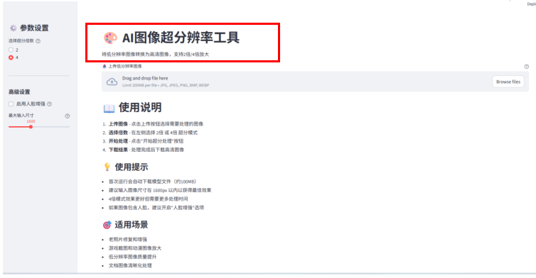
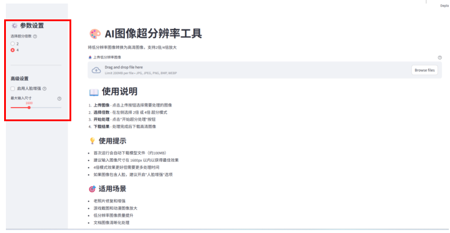
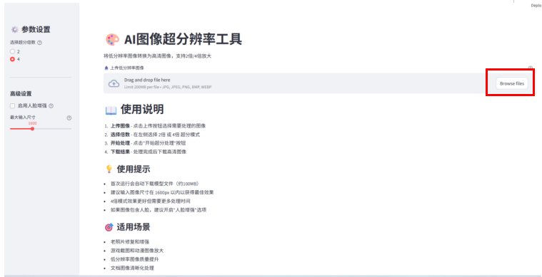
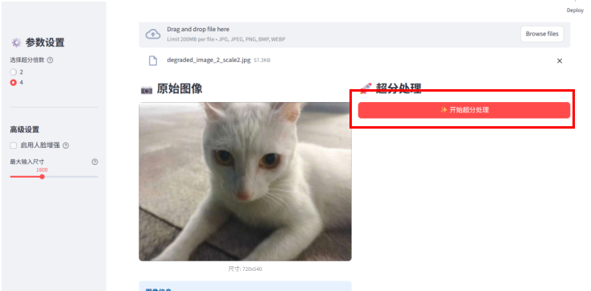
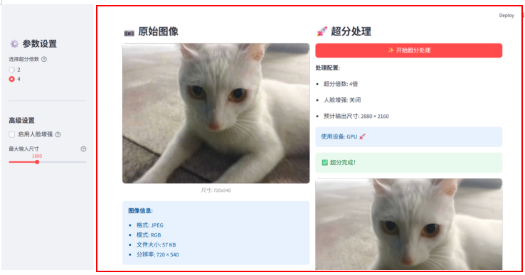
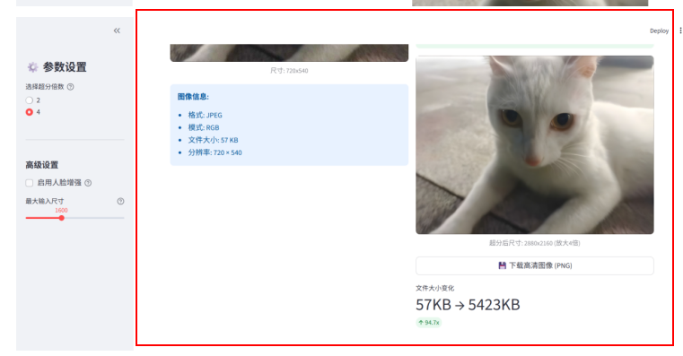
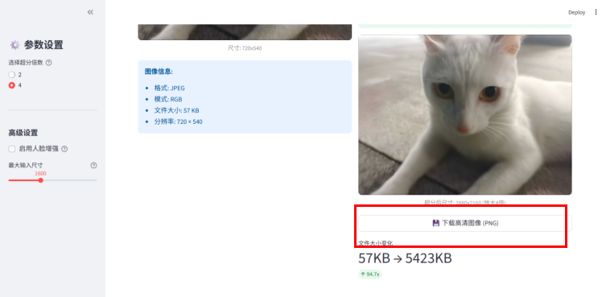

# AI 图像超分工具使用说明文档
本文档用于指导 AI 图像超分工具（基于 Real-ESRGAN 模型）的安装、配置与使用，适用于需要提升图像分辨率提升的用户，无需专业技术背景，按步骤操作即可完成超分处理。

## 1. 工具概述

### 1.1 核心功能
支持将低分辨率图像放大 2 倍 / 4 倍，提升画面清晰度与细节
自动适配 GPU/CPU 运行，GPU 加速可大幅提升处理速度
支持常见常见图像格式（JPG、PNG、BMP 等）的输入与输出
内置分块处理逻辑，避免大图像处理时内存不足问题

处理结果对比展示


### 1.2 技术依赖
核心模型：Real-ESRGAN（超分辨率重建模型）
运行环境：Python 3.6+（推荐 3.8-3.10 版本）
关键依赖：Streamlit（Web 交互界面）、NumPy 1.21.0、PyTorch、Real-ESRGAN

## 2. 环境准备
### 2.1 基础环境安装
安装 Python 3.8 + 版本
下载地址：[Python 官网](https://www.python.org/downloads/)
安装时务必勾选 "Add Python to PATH"（添加到系统环境变量）

或者使用虚拟环境（例如conda）
```
conda create  -- name python38 python=3.8
conda activate python38
```

### 2.2 依赖库安装
打开终端，执行以下命令安装核心依赖：
bash

```
pip install --upgrade pip # 升级pip（提升安装稳定性）
pip install streamlit realesrgan numpy==1.21.0 torch torchvision  # 安装指定版本依赖（避免版本冲突）
```

验证依赖版本:
执行以下命令，确认关键库版本符合要求：
bash
```
pip list | grep numpy       # 需显示 numpy 1.21.0
pip list | grep streamlit   # 需显示 streamlit ≥1.20.0
```

如果是windows请使用
```
pip list | findstr numpy       
pip list | findstr streamlit   
```

### 2.3 模型文件准备
1.自动下载（推荐）：工具启动时会自动检测并下载所需模型，无需手动操作。

2.手动下载（自动下载失败时）：
4 倍超分模型：[RealESRGAN_x4plus.pth](https://github.com/xinntao/Real-ESRGAN/releases/download/v0.1.0/RealESRGAN_x4plus.pth)
2 倍超分模型：[RealESRGAN_x2plus.pth](https://github.com/xinntao/Real-ESRGAN/releases/download/v0.2.1/RealESRGAN_x2plus.pth)

放置路径：
在工具脚本（如app.py）所在目录，创建 weights 文件夹，将下载的模型文件放入该文件夹，最终路径示例：
```
plaintext
工具目录/
├─ app.py
└─ weights/
   └─ RealESRGAN_x4plus.pth  # 4倍模型
```

## 3. 工具运行

### 3.1 启动步骤
1.打开终端，进入工具脚本所在文件夹：
bash

Windows示例（假设工具在D盘）
`cd D:\AI-enhances-image-clarity`

macOS/Linux示例（假设工具在用户目录）
`cd ~/AI-enhances-image-clarity`

2.执行启动命令：
bash
`streamlit run app.py`

3.访问工具：
启动成功后，终端会显示类似以下信息，复制地址在浏览器中打开即可：
plaintext
```
You can now view your Streamlit app in your browser.
Local URL: http://localhost:8501
```

### 3.2 界面说明
区域功能描述
1.标题区:显示工具名称（如 “AI 图像超分工具”）及核心功能说明


2.配置区:可选择超分倍数（2 倍 / 4 倍）、是否启用人脸增强（默认关闭）


3.上传区:点击 “上传图像” 按钮，选择本地图像文件（支持拖放操作）

图像上传后会出现“开始超分处理按钮”，点击即会对图像进行超分处理


4.结果区:左侧显示原始图像，原始图像下方会显示其格式、模式、文件大小、分辨率，右侧显示超分后图像，超分后图像上方显示处理配置以及预计尺寸，下方显示处理前后的文件大小变化，支持鼠标滚轮放大预览细节



5.下载区:超分完成后显示 “下载结果” 按钮，点击可将处理后的图像保存到本地（PNG 格式）


## 4. 操作流程
1.在浏览器打开工具界面，在配置区选择超分倍数（推荐 4 倍，细节提升更明显）。

2.点击上传区的 “浏览文件”，选择需要处理的图像（建议单张大小≤10MB，避免处理过慢）。

3.等待处理完成（根据图像大小和设备性能，耗时 1-30 秒，GPU 处理更快）。

4.对比原始图像与超分结果，确认满意后点击 “下载结果” 保存图像。

## 5. 常见问题
### 5.1 模型加载失败
可能原因：Numpy 版本不兼容、模型文件缺失、依赖未安装完整。
解决方案：
1.重新安装指定版本 Numpy（2.0以上版本不兼容）：
`pip install numpy==1.21.0`
2.检查 weights 文件夹中是否有对应模型，文件名是否正确（如 RealESRGAN_x4plus.pth），网络连接问题可能会导致下载的模型文件损坏，可以手动下载模型文件，在项目根目录创建weights文件夹（如果没有），将模型文件放入weights文件夹
3.重新安装依赖：
`pip install --force-reinstall realesrgan torch`

### 5.2 运行速度慢
可能原因：使用 CPU 运行（未启用 GPU 加速）。
解决方案：
确认电脑有 NVIDIA 显卡，并安装 CUDA Toolkit
安装 GPU 版 PyTorch：参考 PyTorch 官网 选择带 CUDA 的安装命令
重启工具后，终端显示 “使用设备: GPU 🚀” 即表示加速生效

### 5.3 端口占用（启动失败）
错误提示：Address already in use
解决方案：启动时指定其他端口：
bash
streamlit run app.py --server.port 8502  # 8502可替换为8000-9999之间的未占用端口

### 5.4 图像无法上传 / 处理
可能原因：格式不支持、文件过大、图像损坏。
解决方案：
转换为常见格式（JPG/PNG），避免使用 WebP、TIFF 等特殊格式
裁剪或压缩图像（如通过画图工具缩小尺寸），确保单张≤10MB
刷新浏览器后重新上传

## 6. 注意事项
超分倍数越高，处理时间和内存占用越大，低配置电脑建议优先选择 2 倍超分。
处理后图像分辨率为原始尺寸 × 超分倍数（如 500×300 的图像，4 倍超分后为 2000×1200）。
建议保存为 PNG 格式（无压缩损失），JPG 格式可能导致二次画质下降。
工具仅用于技术研究和个人合法用途，请勿处理侵权图像或用于商业违规场景。
如需工具二次开发说明或代码注释，可补充说明具体需求。